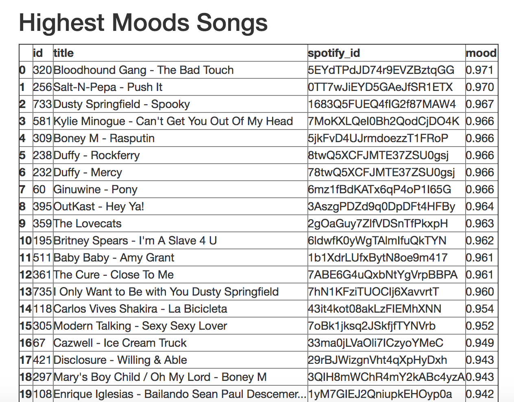
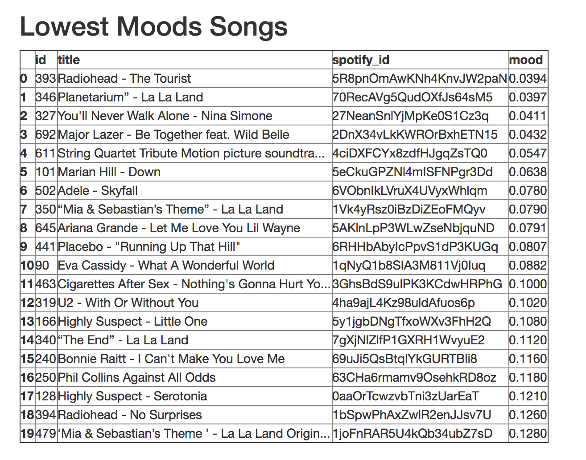

# moodtube

This app allowed me to analyze the mood of my music-related YouTube Watch History.
Displays an interactive graph and two charts in the browser.

Inspiration from [youtube_history](https://github.com/Jessime/youtube_history). Flask 0.12.2, written in Python 3.6 with d3.js data visualization and a PostgreSQL database. Uses [youtube-dl](https://github.com/rg3/youtube-dl), [spotipy](https://github.com/plamere/spotipy).

This student project was my final capstone as the culmination of Ada Developers Academy curriculum.

Interactive graph with hover-able data points:

20 Highest-Mood Songs

20 Lowest-Mood Songs

